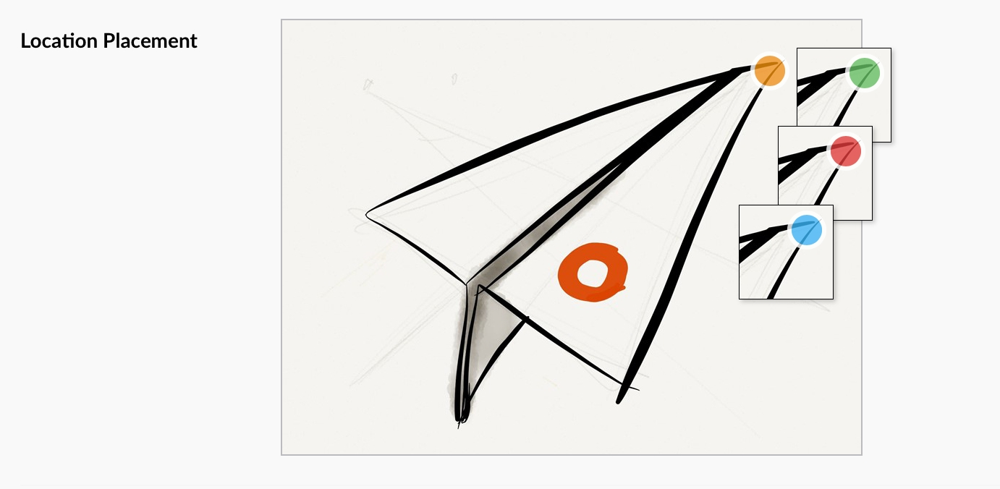
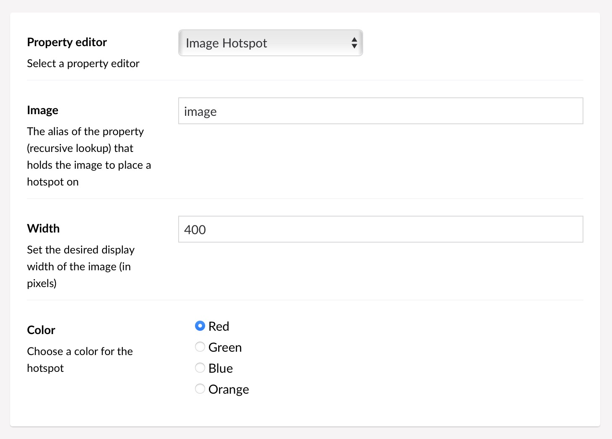

# Image Hotspot for Umbraco


This property editor provides similar functionality to what was previously
available with the
[uComponents ImagePoint](http://ucomponents.github.io/data-types/image-point/)
data type in Umbraco, versions 4 and 6.

(This one's just called “Image Hotspot” because that's what our clients call it
when they ask for this kind of thing 😁)

It's a property editor that displays an image and lets the editor place a hotspot on it.

## Screenshots

### Property editor:



*Property editor with insets showing the alternate colors*

***

The configuration looks like this:

### Configuration:



*DataType Configuration*

The property editor looks for the **Image** by looking up the alias recursively,
so it's possible to use it on a doctype that's used by e.g. **Nested Content**, **Block List** or something like [Embedded Content Blocks](https://our.umbraco.com/packages/backoffice-extensions/embedded-content-blocks/).

***

### Property Data

The raw JSON data looks like this:

```json
{
	"image": "/media/1492/what-a-nice-picture.jpg",
	"left": 223,
	"top": 307,
	"percentX": 55.75,
	"percentY": 74.878048780487804878,
	"width": 400,
	"height": 410
}
```

The hotspot coordinate is saved both as exact pixel values and as percentage
values, along with the image's path, width & height.

The [releases page][RELS] has **PropertyConverters** for v7 and v8, that you can grab and throw in your solution (or drop in the `App_Code` folder.

[RELS]: https://github.com/vokseverk/Vokseverk.ImageHotspot/releases

This enables ModelsBuilder to do its magic and provide you with an `ImageHotspot` object instead:

```csharp
public class ImageHotspot {
	public string Image { get; set; }
	public int Left { get; set; }
	public int Top { get; set; }
	public decimal PercentX { get; set; }
	public decimal PercentY { get; set; }
	public int Width { get; set; }
	public int Height { get; set; }
}
```	
